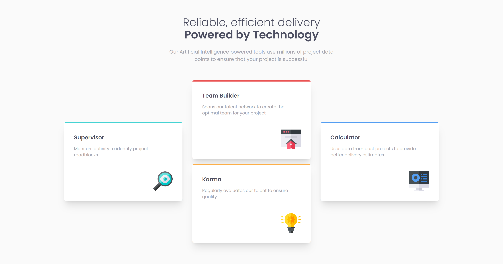

# Frontend Mentor - Four card feature section solution

This is a solution to the [Four card feature section challenge on Frontend Mentor](https://www.frontendmentor.io/challenges/four-card-feature-section-weK1eFYK). Frontend Mentor challenges help you improve your coding skills by building realistic projects. 

## Overview

### The challenge

Users should be able to:

- View the optimal layout for the site depending on their device's screen size

### Screenshot

### Links

- [Frontend Mentor: Solution URL](https://www.frontendmentor.io/solutions/four-card-feature-section-with-react-and-tailwind-css-GmEu63ZP8)
- [Vercel: Live Site URL](https://four-card-feature-section-silk-eta.vercel.app/)

## My process

### Built with

- Semantic HTML5 markup
- CSS custom properties
- Flexbox
- Tailwind CSS
- [React](https://reactjs.org/) - JS library

## What I learned

I just wanted to reinforce my knowledge and practice more with CSS Flexbox. I thought the layout was different from other flexbox layouts, and it helped me think outside of the box. For example, my first approach was to do something with `flex-wrap` and `flex-direction: row`, but the approach that ended up working was to treat the card section as a set of three columns.

Thinking outside of the box and trying different methods to approach a design is a good skill to practice.

## Continued development

This was a small layout challenge that I wanted to do before I move on to harder challenges. It'll help reinforce the basics while I learn more complex features and libraries in React.

A good trick that I ended up learning is that sometimes it's better to center things with `width: %` and `margin: auto` rather than to use grid or flex centering methods.

---

### Useful resources

- [Tailwind CSS Documentation](https://tailwindcss.com/docs/)

## Author
Ian Wu

- Frontend Mentor - [@iannnop](https://www.frontendmentor.io/profile/iannnop)
- LinkedIn - [@iannnop](https://www.linkedin.com/in/iannnop/)
- Instagram - [@iannnop_frontend](https://www.instagram.com/iannnop_frontend/)
- Twitter - [@iannnop](https://www.twitter.com/iannnop)
